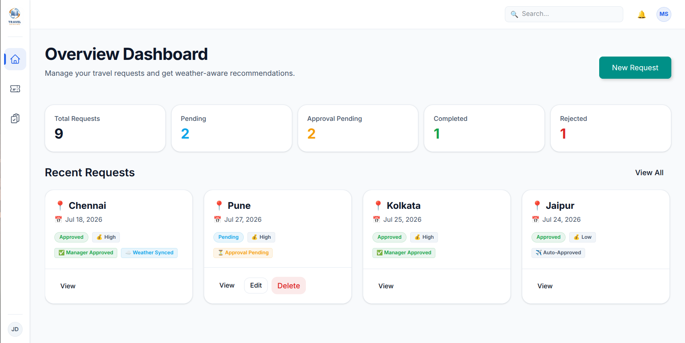
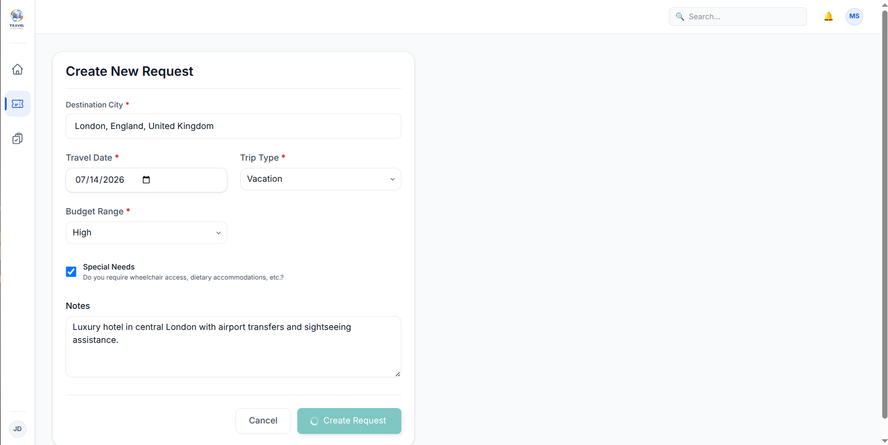
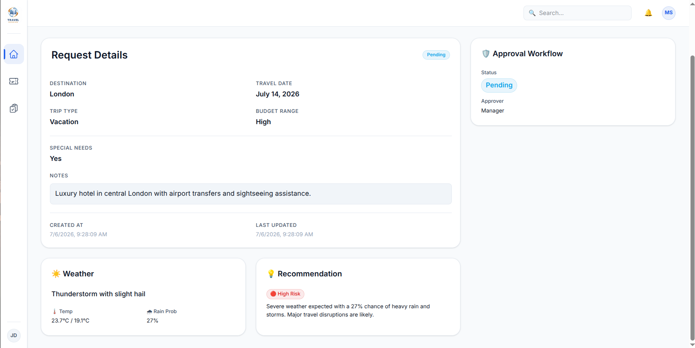
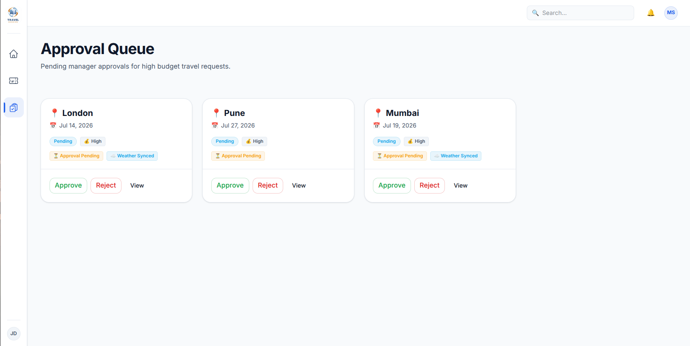
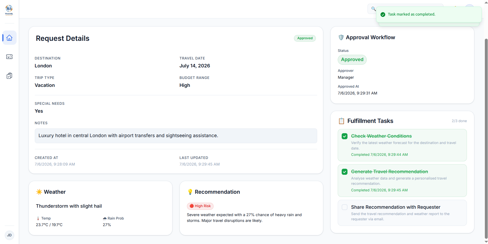
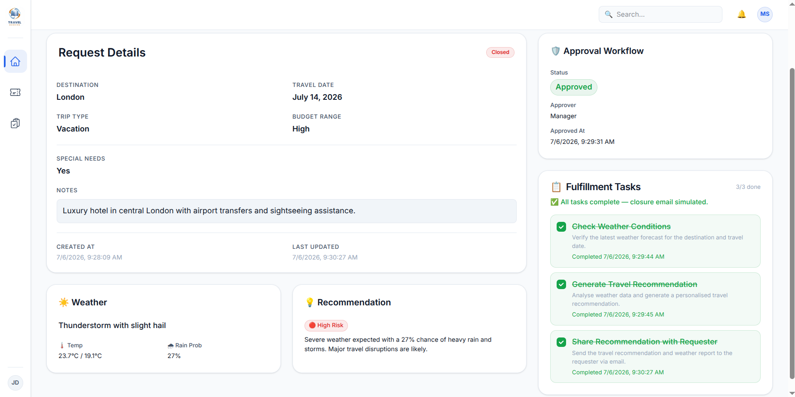

# Weather Travel Planner

## 🌐 Live Deployment

| Service | Platform | URL |
|---|---|---|
| **Frontend** | Netlify | [https://sky-route.netlify.app](https://sky-route.netlify.app) |
| **Backend API** | Render | [https://weather-travel.onrender.com](https://weather-travel.onrender.com) |
| **API Docs** | Render (Swagger) | [https://weather-travel.onrender.com/docs](https://weather-travel.onrender.com/docs) |

> [!NOTE]
> The backend is hosted on Render's free tier. The first request may take 30–60 seconds to wake up after a period of inactivity.

---

## 1. Project Overview

A weather-aware travel planning application that streamlines the process of requesting travel, securing manager approvals, and executing fulfillment tasks. By integrating real-time weather forecasts, the system generates intelligent travel recommendations to ensure employee safety and comfort.

### Features
- **Intelligent City Autocomplete:** Fast destination searching powered by Open-Meteo geocoding.
- **Automated Weather Integration:** Fetches real-time forecasts based on destination and travel dates.
- **Smart Recommendations:** Automatically evaluates weather conditions and generates risk-based recommendations.
- **Dynamic Approval Workflow:** Automatically routes "High" budget requests to an Approval Queue.
- **Fulfillment Task Tracking:** Auto-generates fulfillment checklists for travel teams upon approval.

### Tech Stack
- **Frontend:** React, TypeScript, Vite, React Query, Zod — deployed on **Netlify**
- **Backend:** FastAPI, Python, Motor (Async MongoDB) — deployed on **Render**
- **Database:** MongoDB Atlas
- **External APIs:** Open-Meteo API (Forecast & Geocoding)

## 2. System Architecture


## 3. Workflow Diagram


## 4. Application Screenshots

### Dashboard


---

### Create Travel Request


---

### Request Details (with Weather & Recommendation)


---

### Approval Queue


---

### Fulfillment Tasks


---

### Closed Request


## 5. API Documentation

- `GET /api/v1/requests` - List travel requests.
- `POST /api/v1/requests` - Create a new request.
- `GET /api/v1/requests/{id}` - Retrieve request details.
- `PATCH /api/v1/requests/{id}` - Update a pending request.
- `DELETE /api/v1/requests/{id}` - Delete a pending request.
- `POST /api/v1/requests/{id}/approve` - Approve a request.
- `POST /api/v1/requests/{id}/reject` - Reject a request.
- `POST /api/v1/requests/{id}/tasks` - Auto-create fulfillment tasks.
- `PATCH /api/v1/requests/{id}/tasks/{task_id}/complete` - Complete a task.
- `GET /api/v1/cities/search?q={query}` - Fetch city autocomplete suggestions.

*Detailed Swagger UI documentation is available at [/docs](https://weather-travel.onrender.com/docs).*

## 6. Local Development Setup

### Prerequisites
- Python 3.11+
- Node.js 18+
- MongoDB (local or Atlas)

### Backend Setup
1. Navigate to the backend directory: `cd backend`
2. Create a virtual environment: `python -m venv .venv`
3. Activate the virtual environment:
   - Linux/Mac: `source .venv/bin/activate`
   - Windows: `.venv\Scripts\activate`
4. Install dependencies: `pip install -r requirements.txt`
5. Copy the example env file and configure it:
   ```bash
   cp .env.example .env
   ```
   Set your `MONGO_URI` and other variables in `.env`.
6. Run the server: `uvicorn app.main:app --reload`

### Frontend Setup
1. Navigate to the frontend directory: `cd frontend`
2. Install dependencies: `npm install`
3. Run the development server: `npm run dev`

> **Note:** The frontend reads the API URL from `VITE_API_URL` in `frontend/.env`. If unset, it falls back to `http://localhost:8000/api/v1` for local development.

### Environment Variables

#### Backend (`backend/.env`)
| Variable | Description | Example |
|---|---|---|
| `MONGO_URI` | MongoDB connection string | `mongodb+srv://...` |
| `DATABASE_NAME` | MongoDB database name | `weather_travel` |
| `ALLOWED_ORIGINS` | Comma-separated CORS origins | `https://sky-route.netlify.app` |

#### Frontend (`frontend/.env`)
| Variable | Description | Example |
|---|---|---|
| `VITE_API_URL` | Backend API base URL | `https://weather-travel.onrender.com/api/v1` |

## 7. Deployment

### Backend → Render
1. Connect your GitHub repo to Render.
2. Set **Root Directory** to `backend`.
3. Set **Build Command**: `pip install -r requirements.txt`
4. Set **Start Command**: `uvicorn app.main:app --host 0.0.0.0 --port $PORT`
5. Add environment variables in Render dashboard:
   - `MONGO_URI`
   - `DATABASE_NAME`
   - `ALLOWED_ORIGINS` (comma-separated, e.g. `https://sky-route.netlify.app`)

### Frontend → Netlify
1. Connect your GitHub repo to Netlify.
2. Set **Base Directory** to `frontend`.
3. Set **Build Command**: `npm run build`
4. Set **Publish Directory**: `frontend/dist`
5. Add environment variable in Netlify dashboard:
   - `VITE_API_URL=https://weather-travel.onrender.com/api/v1`

## 8. Future Enhancements
- **Authentication & Authorization:** Secure routes using JWTs and Role-Based Access Control (RBAC).
- **Email Integration:** Send real notification emails for approvals and task completions instead of logging them.
- **AI Integration (Gemini):** Use advanced AI models to generate highly personalized travel insights and full itineraries.
- **Offline Support:** Implement PWA features for viewing itineraries offline.
